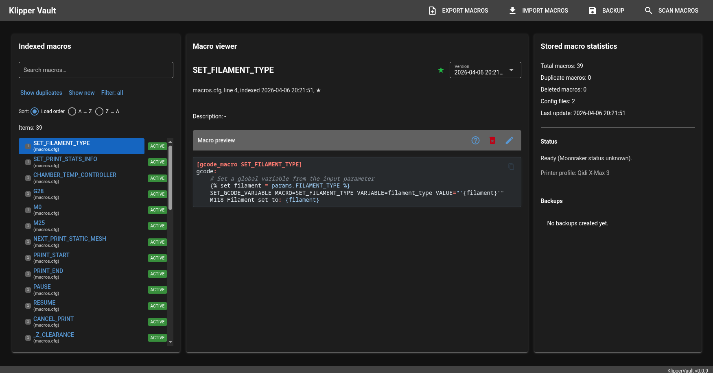
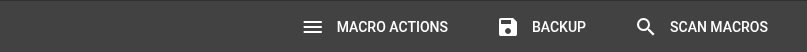
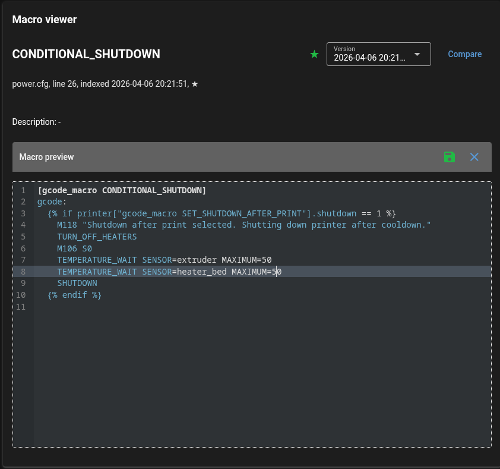
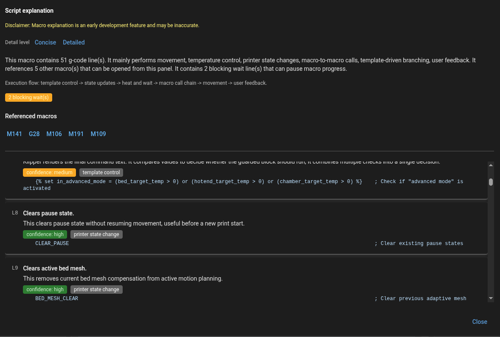
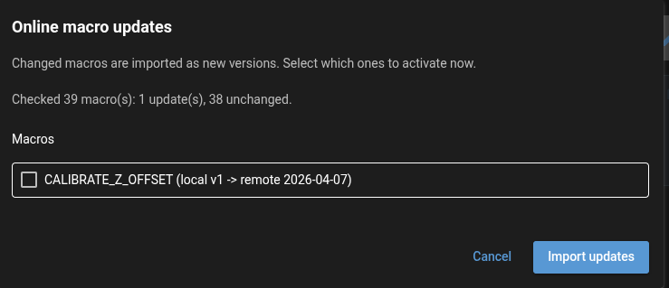
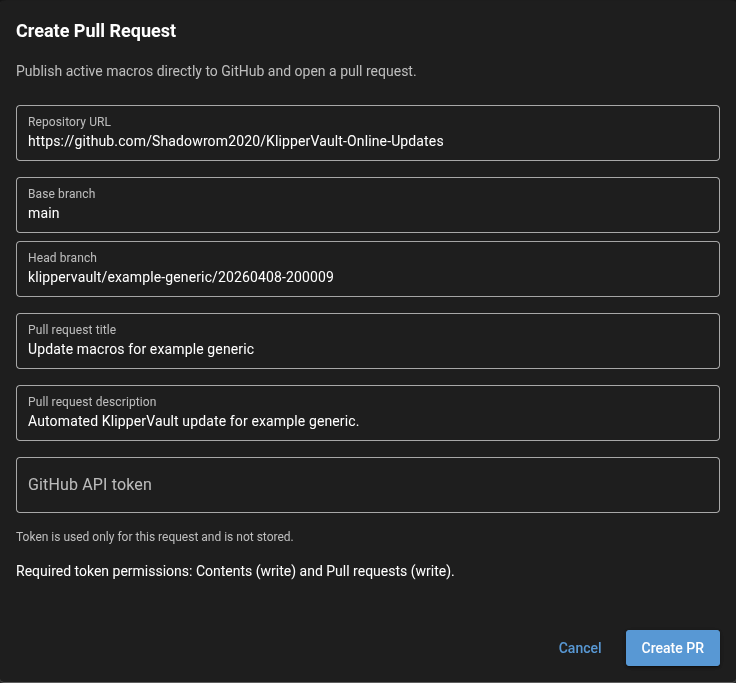

# KlipperVault UI Overview

KlipperVault is a lightweight web interface for managing Klipper `gcode_macro` definitions with version history, safe editing workflows, backup/restore, and Mainsail integration.

## Main Interface

The main interface provides a comprehensive view of all indexed macros with their status and actions.

**Features:**
- Left panel: Browse all macros with status badges (Active/Inactive, Loaded/Not-Loaded, Dynamic)
- Center panel: View macro details, compare versions, and access macro history
- Right panel: View and manage backups with restore and export options
- Real-time status tracking of macro states across your Klipper configuration

## Toolbar & Actions

The toolbar provides quick access to essential operations for managing your macros.

**Key Actions:**
- **Macro Actions Menu**: Consolidated menu containing:
  - **Export Macros**: Share macros with other users or import shared macros
  - **Import Macros**: Upload previously exported macro files
  - **Check for Updates**: Search for macro updates from configured GitHub repositories
- **Developer Menu** (developer mode only):
  - **Export Update Zip**: Export local macros as an update repository bundle
  - **Create Pull Request**: Publish active macros directly to GitHub
- **Scan Macros**: Re-index all macros from your config files
- **Backup**: Create snapshots of your current macro state
- **Reload Dynamic Macros**: Update macros loaded via DynamicMacros plugin
- **Restart Klipper**: Update macros loaded by restarting Klipper

## In-Place Macro Editing

Edit macros directly in the web UI with safe write-back to `.cfg` files.

**Editing Features:**
- Syntax-aware editor for gcode macros
- Real-time validation and error highlighting
- Version history tracking (only saves when content changes)
- Safe write-back with Moonraker integration
- Protection against edits during active prints

## Macro Explainer

Understand complex macros with AI-assisted explanations and cross-linking between related macros.

**Explanation Features:**
- Line-by-line breakdown of macro functionality
- Cross-links to referenced macros and commands
- Help understanding complex gcode sequences
- Optional panel that appears alongside macro details

## Online Macro Updates

Check for and import macro updates from GitHub-hosted repositories with selective activation.

**Update Features:**
- Check for updates from optional GitHub repositories
- Compare local macros against remote versions via checksums
- Import updates as new inactive versions for review
- Selectively activate imported updates
- Support for printer vendor/model-specific macro updates
- Automatic startup update check when a repository is configured
- Mainsail notification when startup update checks detect updates
- Export local macros as repository bundles (developer mode)

## Core Capabilities

### 📋 Version History
- Automatic macro version history with configurable retention
- Track all changes to your macro definitions
- Compare versions side-by-side
- Restore previous versions with one click

### 🔄 Backup & Restore
- Create named backups of macro snapshots
- Restore entire backup sets or individual macros
- Export macros for sharing or archival
- Import macros from other users

### 🔐 Safe Editing
- In-place editing with write-back to cfg files
- Moonraker print-state safety gates prevent editing during active prints
- Duplicate macro detection with conflict resolution
- Version tracking for all changes

### 🔗 Macro Sharing
- Export macros into portable JSON files with metadata
- Import shared macros for review before activation
- Track printer vendor/model information
- Collaborative macro development

### 🌐 Online Macro Updates
- Connect to GitHub-hosted macro repositories
- Automatic update checking with version comparison
- Import updates as inactive versions for selective activation
- Support for printer-specific macro variants
- Developer mode for exporting macro bundles

## Publishing Macros via GitHub

KlipperVault enables developers to maintain and distribute macro collections through GitHub repositories.

**Publishing Features:**
- **Create Pull Requests**: Publish local macros directly to GitHub repositories from the KlipperVault UI
- **Secure Token Handling**: Use personal access tokens for authentication without storing credentials
- **Version Tracking**: Automatic versioning and manifest updates for published macros
- **Vendor/Model Organization**: Macros are organized by printer vendor and model for easy discovery
- **Export Bundles**: Export local macros as ZIP files for distribution or testing

**Key Capabilities:**
- One-click publishing of active macros to remote repositories
- Support for vendor and model-specific macro variants
- Automatic conflict detection (prevents duplicate pull requests)
- Secure token storage recommendations (KeePass, Bitwarden, 1Password, etc.)
- Full documentation on repository setup and token management

For detailed setup instructions including repository configuration, token generation, and secure storage best practices, see the [**Macro Developer Guide**](Macro_Developer.md).

### ⚡ Dynamic Macro Support
- Full support for [DynamicMacros](https://github.com/3DCoded/DynamicMacros) plugin
- Dedicated reload action for dynamically loaded macros
- Status badges for dynamic macro detection
- Seamless integration with dynamic config loading

---

**KlipperVault** • [GitHub](https://github.com/3DCoded/KlipperVault) • [License](LICENSE)
